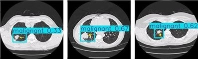
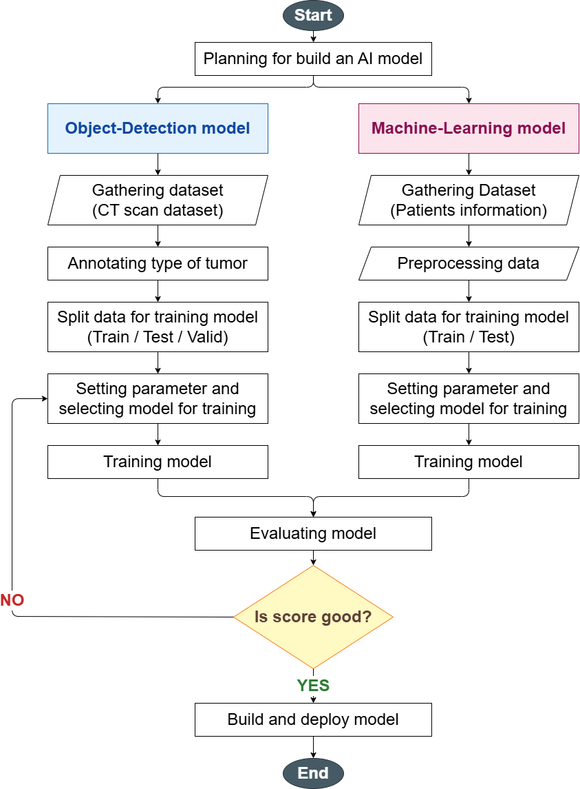
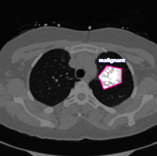
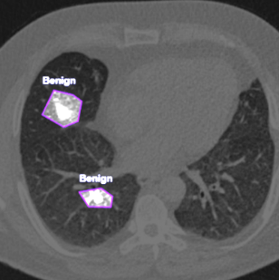
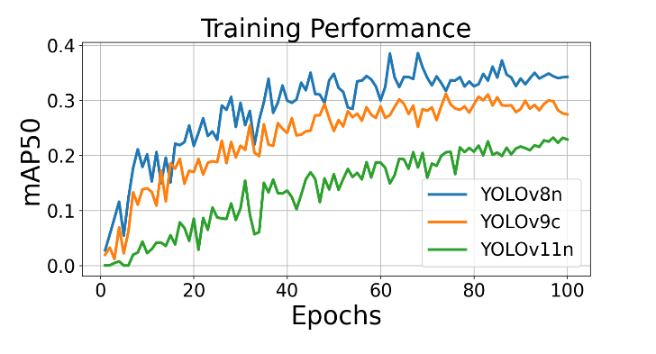
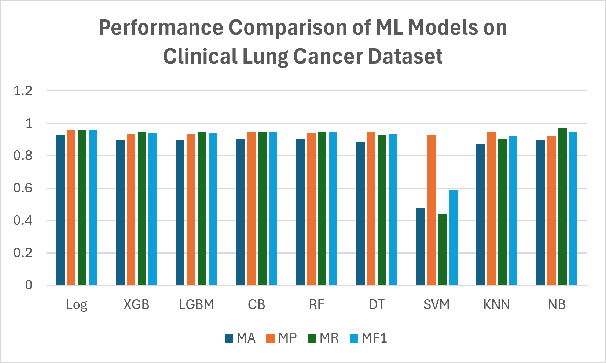

<div align="center">

# Lung Cancer Risk Project

**Dual-pipeline AI for lung cancer screening — YOLO tumor detection on CT scans + machine-learning risk classification on clinical data, combined into one interpretable risk score.**


<br />



<sub>YOLOv8n predictions on CT slices — each box is a detected nodule with its class and confidence.</sub>

</div>

---

## Highlights

| | |
|---|---|
| **Image pipeline** | YOLO detects and classifies nodules (benign / malignant) on axial CT slices. Best model: **YOLOv8n**, mAP50 **0.385** on the researcher-annotated test set and **0.687** against physician-verified annotations. |
| **Clinical pipeline** | Nine classifiers on 309 patient records (symptom / risk features), 10-fold stratified CV with SMOTE inside each training fold. Best accuracy: **Logistic Regression 0.929**; best tuned F1: **CatBoost 0.953**. |
| **Integrated risk score** | `Score = 100 × (0.5·P(malignant) + 0.5·P(cancer))` — a 0–100 value mixing the imaging and clinical probabilities. |

> The two pipelines were trained on **separate datasets**, so the integrated score is a proposed framework, not an empirically validated result. See [Limitations](#limitations).

## How it works

<div align="center">

</div>

A model passes evaluation at AUC-ROC ≥ 0.85 and mean sensitivity ≥ 0.80 on the held-out test set.

Both branches follow the same loop: gather data → prepare it → split → pick model and parameters → train. Their outputs meet at a single **evaluation** step. If the score is not good enough, parameters are adjusted and the model is retrained; otherwise it is built for deployment.

| | Object-detection branch | Machine-learning branch |
|---|---|---|
| Data | IQ-OTH/NCCD CT scans — 649 axial images (456 train / 96 val / 97 test), 102 benign + 547 malignant boxes | 309 patient records (270 positive / 39 negative) |
| Prep | Manual bounding-box annotation in Roboflow, flip / rotation / brightness augmentation | Encoding, missing values, standardization, SMOTE |
| Models | YOLOv6n, v8n, v9c, v10n, v11n | Log, XGB, LGBM, CatBoost, RF, DT, SVM, KNN, NB |

## Object detection (CT images)

### Annotation

Nodules are boxed and labelled by hand. Class labels come from the IQ-OTH/NCCD dataset; box placement uses size and location in the lung.

<div align="center">


</div>

<div align="center"><sub>Left: malignant nodule. Right: two benign nodules.</sub></div>

### Training performance

<div align="center">

</div>

Validation mAP50 over 100 epochs. All three models climb steadily and flatten out near the end. YOLOv8n (blue) stays above YOLOv9c and YOLOv11n for most of training. The raw per-epoch values for all five models are in [`yolo_mpa50.csv`](yolo_mpa50.csv).

### Model comparison

| Model | mAP50 | Precision | Recall |
|---|---|---|---|
| YOLOv6n | 0.232 | **0.694** | **0.456** |
| **YOLOv8n** | **0.385** | 0.647 | 0.435 |
| YOLOv9c | 0.346 | 0.657 | 0.429 |
| YOLOv10n | 0.311 | 0.602 | 0.432 |
| YOLOv11n | 0.372 | 0.664 | 0.446 |

YOLOv8n wins on mAP50 despite being older than v9–v11. YOLOv6n has the best precision but the worst mAP50 — it is conservative and misses nodules.

**Annotation quality matters more than model choice.** Re-scoring YOLOv8n against annotations verified by licensed physicians raises mAP50 from 0.385 to **0.687**, so much of the apparent error came from noisy researcher-drawn boxes, not from the model.

## Machine learning (clinical data)

Features are survey-style: gender, age, smoking, yellow fingers, anxiety, peer pressure, chronic disease, fatigue, allergy, wheezing, alcohol, coughing, shortness of breath, swallowing difficulty, chest pain. Target: `LUNG_CANCER`.

### Model comparison

<div align="center">

</div>

Mean accuracy (MA), precision (MP), recall (MR) and F1 (MF1) over 10-fold CV, default parameters. Most models land between roughly 0.87 and 0.96 on every metric. **SVM is the outlier**: its precision is fine (0.925) but recall collapses to 0.441, dragging accuracy to 0.479 — it predicts "no cancer" far too often.

| Model | MA | MP | MR | MF1 |
|---|---|---|---|---|
| **Log** | **0.929** | **0.960** | 0.959 | **0.959** |
| XGB | 0.900 | 0.938 | 0.948 | 0.942 |
| LGBM | 0.900 | 0.938 | 0.948 | 0.942 |
| CB | 0.906 | 0.948 | 0.944 | 0.945 |
| RF | 0.903 | 0.941 | 0.948 | 0.944 |
| DT | 0.887 | 0.945 | 0.926 | 0.934 |
| SVM | 0.479 | 0.925 | 0.441 | 0.588 |
| KNN | 0.871 | 0.947 | 0.904 | 0.924 |
| NB | 0.900 | 0.920 | **0.970** | 0.944 |

Naive Bayes has the highest recall (0.970) — useful when a missed cancer is the worst outcome — at the cost of lower precision.

### Discriminative power (ROC-AUC)

| Model | Mean AUC | Std |
|---|---|---|
| **Log** | **0.937** | 0.054 |
| RF | 0.922 | 0.067 |
| CB | 0.915 | 0.082 |
| LGBM | 0.904 | 0.090 |
| XGB | 0.901 | 0.085 |
| NB | 0.899 | 0.089 |
| KNN | 0.856 | 0.144 |
| DT | 0.795 | 0.142 |
| SVM | 0.678 | 0.135 |

Logistic Regression ranks first again. Everything down to KNN clears the 0.85 target; DT and SVM do not. Standard deviations are large for DT, SVM and KNN, so their ranking is less certain.

### CatBoost tuning

Grid search over iterations, learning rate (eta) and tree depth (full tables in `cb_hyperparam_results.xlsx`):

- **Iterations:** F1 peaks at **1,000** (0.953) and does not improve at 2,000.
- **Depth:** 4 and 8 tie at accuracy 0.919 / F1 0.953; **8** was chosen for capacity.
- **Eta:** 0.05 and 0.20 tie; **0.05** was chosen because it is more stable against overfitting.

## Integrated risk score

```
Score = 100 × ( 0.5 × P(malignant)  +  0.5 × P(cancer) )
          imaging (YOLO)          clinical (ML)
```

Equal weights because there is no prior evidence favouring either modality. A missing nodule (`P(malignant) = 0`) still leaves the clinical half, so the score stays informative.

| Case | P(malignant) | P(cancer) | Score | Risk |
|---|---|---|---|---|
| A | 0.00 | 0.70 | 35.0 | Moderate |
| B | 0.85 | 0.60 | 72.5 | High |
| C | 0.20 | 0.15 | 17.5 | Low |

`probability_cancer.csv` applies a Mayo-Clinic-style malignancy probability from age, smoking, cancer history, nodule diameter, spiculation and upper-lobe location.

## Limitations

- Image and clinical models were trained on different datasets; the combined score is not validated on a single patient cohort.
- Detection dataset is small (649 images) and partly annotated by non-experts. Recall is low (0.435 for YOLOv8n) — the main weakness for a screening tool.
- Detection data was split by image, not by patient, and there is no external validation.
- The clinical dataset is symptom-based and has no radiological measurements.

This is research code, **not** a medical device.

## Project structure

```
src/
  ml/          Training, preprocessing, detection, and evaluation scripts
  reporting/   Report/document generation utilities (Word, PDF, Excel)
docs/images/   Figures used in this README
requirements.txt
```

### `src/ml/`
- `Train_Information_dataset.py`, `train_new_dataset.py`, `train_smote.py`, `train_cb_hyperparam.py` — train tabular classifiers on survey data
- `run_roc_auc.py` — cross-validated ROC-AUC comparison across models
- `Prepocessing.py` — CT image preprocessing (contrast/exposure adjustment)
- `Train_Detection_Lung_cancer.py` — YOLO training/evaluation for tumor detection
- `Grad_Cam.py` — Grad-CAM visualization for detection results
- `plot_figure8.py`, `plot_figure8_excel.py`, `plot_graph.py` — result plotting/figures

### `src/reporting/`
- `docx_edit.py` — shared Word-document editing helpers
- `add_risk_section.py`, `grammar_fix.py`, `renumber_tables.py`, `renumber_and_cite_auc.py` — automated edits to the manuscript (.docx)
- `build_changes_pdf.py`, `make_pdf.py` — generate PDF summaries

## Setup

```bash
pip install -r requirements.txt
```

## Data and trained models (not included in this repo)

Large datasets, YOLO weights, and trained model files (`*.pkl`, `*.pt`) are excluded via `.gitignore` — they're too large for a normal git repo and are regenerated by the training scripts.

- **CT scan dataset**: [IQ-OTH/NCCD lung cancer dataset](https://www.kaggle.com/datasets/hamdallak/the-iqothnccd-lung-cancer-dataset) — place under `The IQ-OTHNCCD lung cancer dataset/`
- **YOLO detection dataset**: Roboflow project `cancer-detection-attempt-1` — place under `cancer_lastest/` (see `cancer_lastest/data.yaml`)
- **Trained models**: run the training scripts in `src/ml/` to regenerate `*.pkl` (tabular classifiers) and `runs/detect/*/weights/*.pt` (YOLO)

Small result/reference files used for figures and tables (e.g. `lung_cancer_dataset.csv`, `survey_lung_cancer.csv`, `model_evaluation_results.csv`) remain in the repo root.
